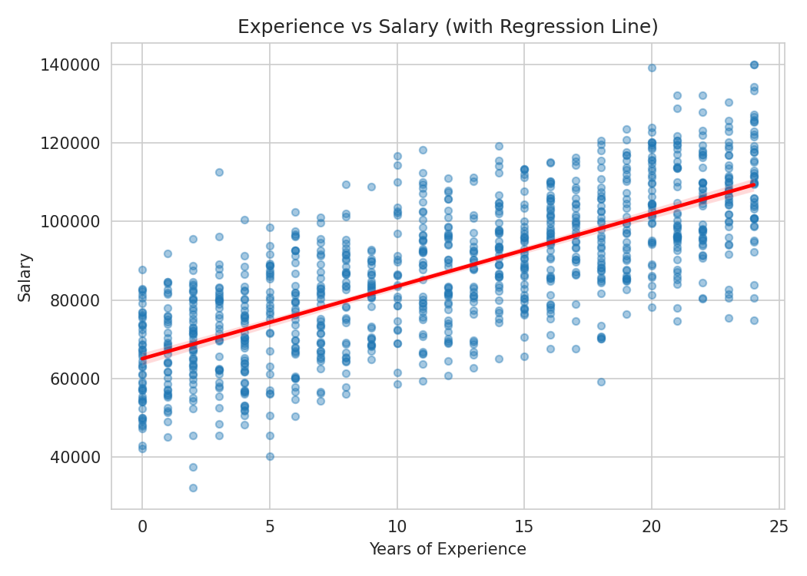
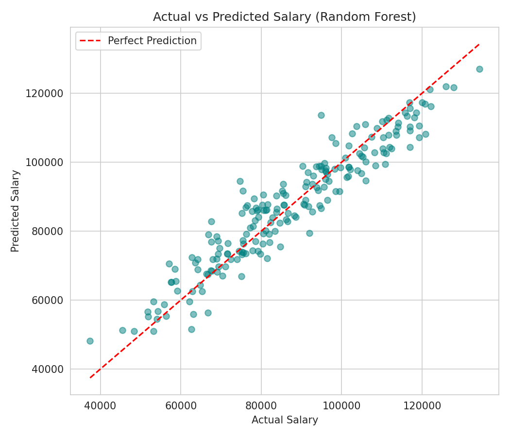
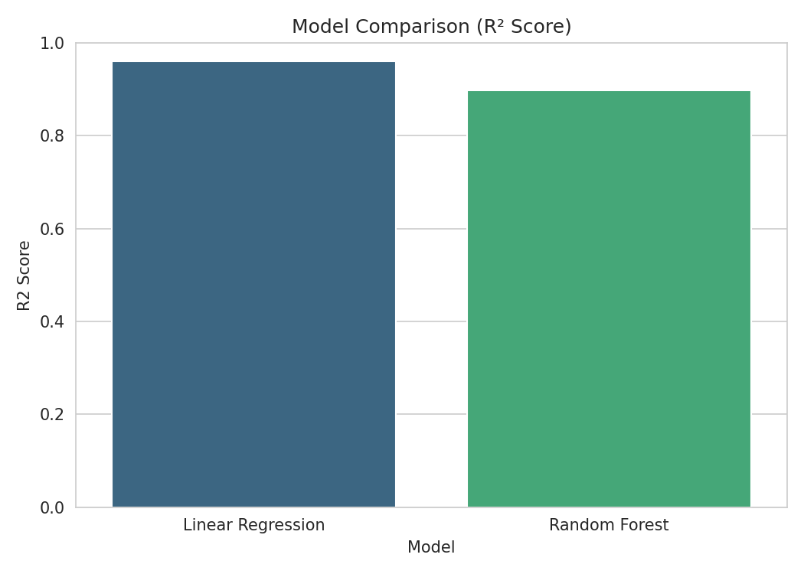

# 💼 Employee Salary Prediction

A complete machine learning project that predicts an employee's salary based on factors like experience, education, job role, location, and company size — built using Python and scikit-learn.

--- 

## 📖 What Is This Project?

This project is an **end-to-end regression-based ML system** that takes details about an employee (years of experience, education level, job role, location, company size) and predicts their expected salary. It covers the full machine learning lifecycle: data exploration, cleaning, feature engineering, model training, evaluation, tuning, and saving the final model for reuse.

---

## 🎯 What Problem Are We Solving?

Salary decisions are often inconsistent — different recruiters or managers may offer different pay for similar roles based on guesswork, negotiation skill, or bias rather than objective criteria. This creates pay gaps and makes it hard for both companies and job-seekers to know what a "fair" salary looks like for a given profile.

**The problem this project solves:** given an employee's profile, predict a data-driven, consistent salary estimate — useful for HR teams setting pay bands, for job-seekers benchmarking offers, and for companies auditing pay equity.

---

## 🧠 How We Solved It

We framed this as a **supervised regression problem**: salary is the continuous target variable, and experience/education/role/location/company size are the input features. The approach:

1. Explore the data to understand which factors actually drive salary.
2. Clean and properly encode the data so models can use it.
3. Train more than one model — a simple, interpretable baseline (Linear Regression) and a more powerful, flexible model (Random Forest) — to see which one captures the salary patterns best.
4. Evaluate both fairly on unseen test data, tune the better one, and use it to make real predictions.

---

## 🛠️ Tech Stack

- **Language:** Python
- **Data handling:** pandas, numpy
- **Visualization:** matplotlib, seaborn
- **Modeling & evaluation:** scikit-learn
- **Persistence:** joblib

---

## 🔁 Step-by-Step: How We Worked Through This Project

**Step 1 — Import Libraries**
Loaded all required libraries for data handling, visualization, and modeling.

**Step 2 — Load the Dataset**
Brought in employee records containing experience, education, job role, location, company size, and salary.

**Step 3 — Exploratory Data Analysis (EDA)**
Examined data types, summary statistics, and missing values; visualized relationships between features and salary to understand the data before touching it.

**Step 4 — Data Cleaning**
Removed duplicates and handled missing values so the dataset is reliable for modeling.

**Step 5 — Encode Categorical Features**
Converted text categories into numbers: ordinal encoding for Education (since it has a natural order) and one-hot encoding for Job Role, Location, and Company Size (no natural order).

**Step 6 — Train/Test Split**
Split the data 80/20 so model performance could be honestly evaluated on data it never saw during training.

**Step 7 — Feature Scaling**
Standardized numeric features (fit only on training data, to avoid data leakage) so distance-based models aren't biased by feature scale.

**Step 8 — Build & Train Models**
Trained a Linear Regression baseline and a Random Forest Regressor, then compared them.

**Step 9 — Evaluate Models**
Measured both models using MAE, RMSE, and R² on the test set.

**Step 10 — Hyperparameter Tuning**
Used GridSearchCV to search Random Forest hyperparameters (number of trees, depth, split size) and picked the best-performing combination.

**Step 11 — Predict on New Data**
Used the final tuned model to predict salary for a brand-new, hypothetical employee profile.

**Step 12 — Save the Model**
Saved the trained model and scaler to disk with joblib so it can be reused in an app without retraining.

---

## 📊 Visualizations & Graphs

### Feature Correlation with Salary
Shows which features are most strongly correlated with salary — experience and company size tend to show the strongest positive relationship.

### Experience vs Salary (Regression Line)
A clear upward linear trend: salary increases steadily as experience increases, which is exactly why a regression-based approach makes sense here.

### Salary Distribution by Job Role
Box plot showing how salary ranges differ across job roles, including spread and outliers within each role.

### Actual vs Predicted Salary
Compares the model's predicted salaries against the true salaries on the test set — points closer to the red dashed line indicate more accurate predictions.

### Residual Plot
Plots prediction errors (residuals) against predicted values. Residuals scattered evenly around zero (with no obvious pattern) indicate the model isn't systematically over- or under-predicting.

### Feature Importance
Shows which features the Random Forest model relied on most when making predictions — experience and company role tend to dominate.

### Model Comparison
Compares the R² score of Linear Regression vs Random Forest, showing how each model performed relative to the other.

---

## 📈 Results

| Model | MAE | RMSE | R² Score |
|---|---|---|---|
| Linear Regression | ~3,070 | ~3,879 | ~0.96 |
| Random Forest | ~4,972 | ~6,192 | ~0.90 |

> Note: these numbers come from a synthetic demo dataset generated inside the notebook. Replace it with your real dataset to get results that reflect your actual use case — the relative comparison process stays the same.

---

## 📁 Project Files

- `Employee_Salary_Prediction.ipynb` — full project notebook (interview prep + step-by-step pipeline)
- `Salary_Prediction_Interview_Questions.ipynb` / `.md` — standalone interview Q&A, basic to advanced
- `README.md` — this file
- `images/` — all graphs referenced above

---

## 🚀 How to Run

1. Install dependencies: `pip install pandas numpy matplotlib seaborn scikit-learn joblib`
2. Open `Employee_Salary_Prediction.ipynb` in Jupyter Notebook or JupyterLab.
3. Run all cells top to bottom — it works out of the box on a built-in synthetic dataset.
4. To use your own data, replace the dataset-generation cell with `df = pd.read_csv("your_file.csv")`.

---

## 🔮 Future Improvements

- Use a real-world dataset instead of the synthetic one.
- Try gradient boosting models (XGBoost, LightGBM) for potentially better accuracy.
- Add SHAP/LIME for explainable, per-prediction interpretability.
- Deploy the model as an interactive web app (Streamlit/Flask) for live predictions.

---

## ✅ Conclusion

This project walks through a complete, real-world ML workflow for salary prediction — from raw data to a tuned, saved model — while keeping every step explained so it doubles as both a working project and a learning resource.
